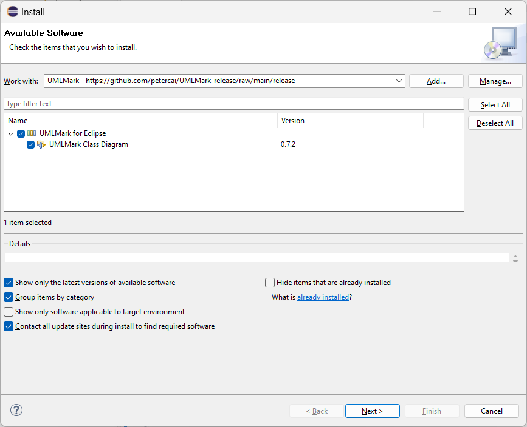
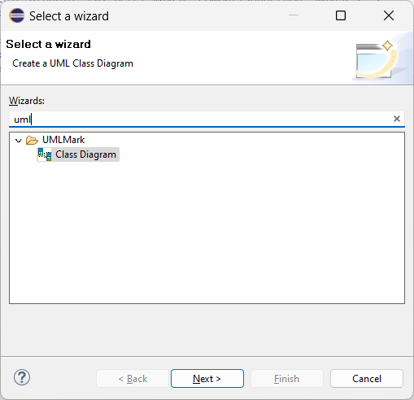
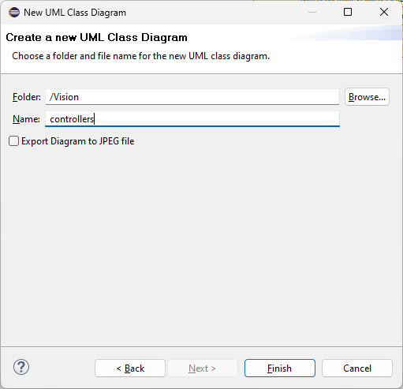
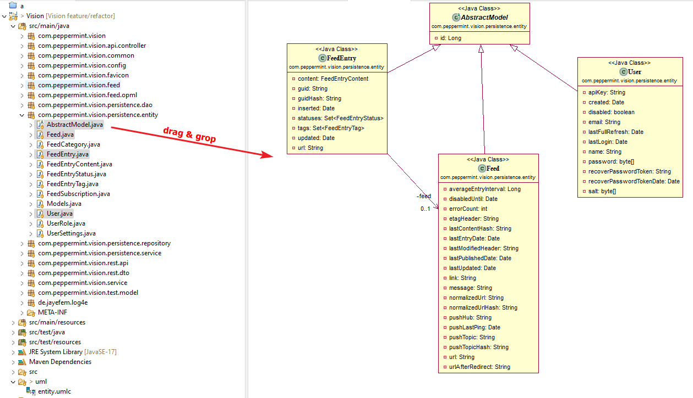

# UMLMark
The UMLMark Eclipse plug-in is a handy 'architecture as code' tool designed to simplify software development and enhance code understanding. With UMLMark, you can effortlessly create UML Class Diagrams directly from your Java code using  drag-and-drop in Eclipse IDE, providing a visual representation of your software's structure. This tool is especially beneficial for developers, and architects, who want to navigate their code and review the design more effectively.

UML Class Diagrams serve as invaluable assets in software development, offering a bird's-eye view of your application's architecture. They help streamline code comprehension, making it easier to identify relationships between classes, packages, and components. By using the UMLMark Eclipse plug-in's intuitive drag-and-drop feature, you can easily visualize your code's structure, making it easier to make informed design decisions and maintain the integrity of your software. Whether you're developing a new application or working on an existing project, UMLMark empowers you to maintain a clear overview of your software's architecture, fostering better collaboration and design evaluation.

Features
---------

1. Drag-and-Drop UML Class Diagram Creation:
   - Intuitively create UML Class Diagrams by simply dragging and dropping Java classes onto the diagram canvas.
2. Automatic Relationship Visualization:
    - UMLMark automatically establishes and visualizes relationships between classes, providing a clear and immediate overview of your software's architecture.
3. Display Filters for Class Attributes and Methods:
    - Easily manage the level of detail by toggling display filters for class attributes and methods. Focus on what matters most for your current analysis or design task.
4. Real-time Code Synchronization:
    - Experience real-time synchronization between your Java code and the UML Class Diagram. Any code changes are instantly reflected in the diagram, ensuring that your documentation remains up-to-date.
5.  Export to JPEG:
    - Seamlessly export your UML Class Diagrams to JPEG files for sharing with team members, stakeholders, or documentation purposes.

## Requirements
- Eclipse 2022-09 or above

##  Installation

**Eclipse Update Site:** 
https://github.com/petercai/UMLMark-release/raw/main/release 
   
_(Note that this URL may not work inside the browser, but **will** work in Eclipse.)_
   
1. Open your Eclipse IDE
2. Open the "Install" dialog (*Help* -> *Install New Software*)
3. Enter the URL of the update site

      
      
4. Check all components in UMLMark for Eclipse
5. Select and install via "Finish"

     
## Usage:

1. Select UMLMark class diagram in File -> New -> Other (Ctrl+N) wizard

   
2. Choose a folder and diagram file name

   
3. Add Java classes to the diagram using drag-and-drop

   

## Changelog
* 2023-11: Version 0.8.1
  * first release
